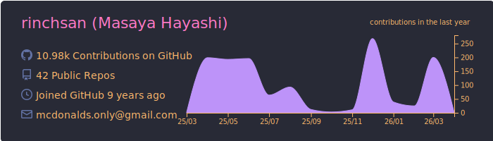
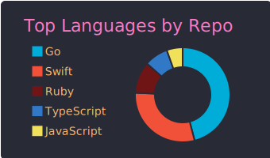
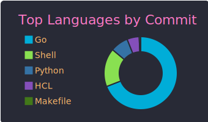
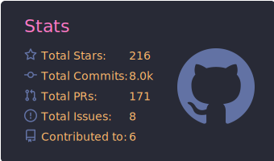
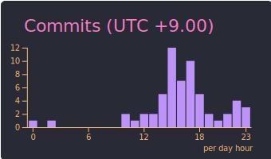

## :sunglasses: I'm maintaining ...

## :space_invader: Public Activities

:running_man: **[See more ...](https://github.com/pulls?q=involves%3Arinchsan+-author%3Aapp%2Frenovate+sort%3Aupdated-desc+is%3Apublic+)**

## :robot: Private Activities

## :nerd_face: I like ...

## :gear: Powered by ...

