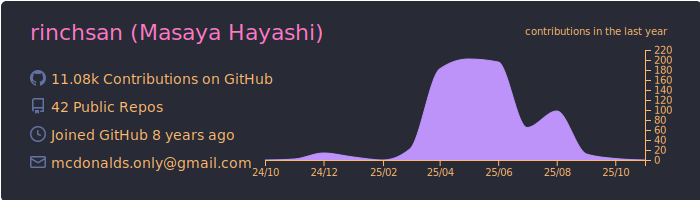
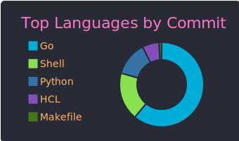
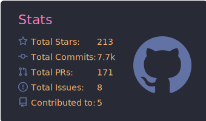

## :nerd_face: I like ...

## :sunglasses: I'm maintaining ...

## :space_invader: Public Activities

:running_man: **[See more ...](https://github.com/pulls?q=author%3Arinchsan+is%3Apublic)**

## :robot: Private Activities

## :mortar_board: Education

- [National Institute of Technology, Akashi College](https://www.akashi.ac.jp) (Major in Electrical and Computer Engineering) (2011-2016)
- [The University of Tokyo](https://www.u-tokyo.ac.jp) (Major in Electrical and Electronic Engineering) (2016-2019)

## :technologist: Career

- Software Engineer Internship at [@hatena](https://github.com/hatena) / [@rakuten](https://github.com/rakutentech) / [@wantedly](https://github.com/wantedly) / [@dena](https://github.com/dena) / [@cyberagent](https://github.com/cyberagent) (2017-2018)
- Software Engineer Internship at [@cyberagent](https://github.com/cyberagent) (2018-2019)
- Software Engineer at [@cyberagent](https://github.com/cyberagent) (2019-2020)
- Software Engineer at [@snkrdunk](https://github.com/snkrdunk) (2020-)

## :gear: Powered by ...

